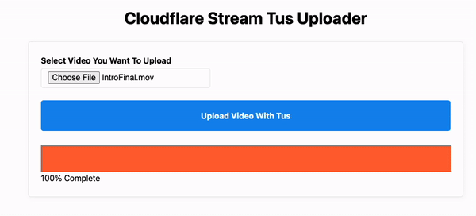

# 🎥 Cloudflare Stream Upload Demo



# Background

From Cloudflare
> Cloudflare Stream is a live streaming and on-demand video platform, which can ingest, encode, record, and play videos from one unified product.

[Cloudflare Stream](https://developers.cloudflare.com/stream/ "Cloudflare Stream") will handle the heavy lifting when it comes to video. Cloudflare manages authenticated streams, encoding, live streaming, storage and more all through their simple API or easy to use web dashboard.

## What is tus?

Historically it stood for Transloadit Upload Server, later repurposed to The Upload Server. `tus` provides a universal spec for _how_ resumable uploads and large file uploads should work. `tus` is built on top of HTTP/HTTPS, making it widely available on most platforms we use today.  

Does is great if you:
- Need to handle large file uploads
- Have users with potentially unreliable network connections
- Want to provide pause and resume capabilities to your users

## What Are Creator Uploads?

Cloudflare Stream offers[ _many_ ways to upload videos](https://developers.cloudflare.com/stream/uploading-videos/ways-to-upload/ " _many_ ways to upload videos"). Of these methods available, _creator uploads_ is one of the most unique and useful methods. 

From Cloudflare Docs:
> Direct creator uploads allow users to upload videos without API tokens. A common place to use Direct creator uploads is on web apps, client side applications, or on mobile apps where users upload content directly to Stream.

# Getting Started

This repo leverages the following tools:
- [Cloudflare Wrangler](https://developers.cloudflare.com/workers/wrangler/ "Cloudflare Wrangler")
- [Cloudflare Workers](https://developers.cloudflare.com/workers/ "Cloudflare Workers")
- [Cloudflare Stream](https://developers.cloudflare.com/stream/ "Cloudflare Stream")
- [Typescript/Javascript](https://docs.microsoft.com/en-us/learn/modules/typescript-get-started/ "Typescript/Javascript")

## Running Cloudflare Worker Locally

0. Login to your Cloudflare account with `wrangler login`
1. `cd server && npm i`
2. `wrangler dev --port 5500`
3. Your endpoint is now available on `http://localhost:5500`

> Note: There are two secrets used in this repository. You can view these secrets in wrangler.toml

To add a secret to Cloudflare using `wrangler`, you can run the following:

```
wrangler secret put ACCOUNT_ID_DEMO
wrangler secret put TOKEN_DEMO
```

## Deploying To The Web

Deployment to the world-wide-web is simple.

1. `cd server && npm i`
2. `wrangler publish`

## Running The Client

This demo intentionally uses _vanilla_ Javascript to keep things simple. Everything can be loaded by simply opening the `index.html` file in your browser. 